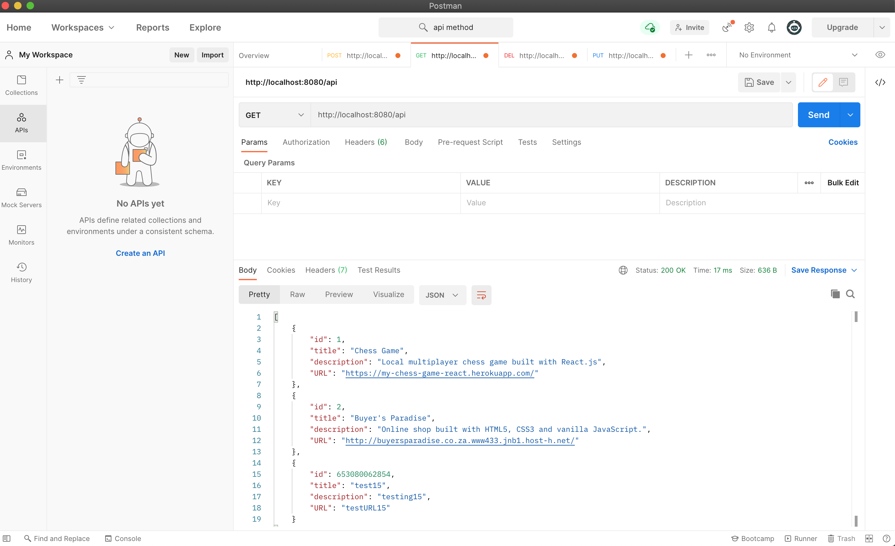
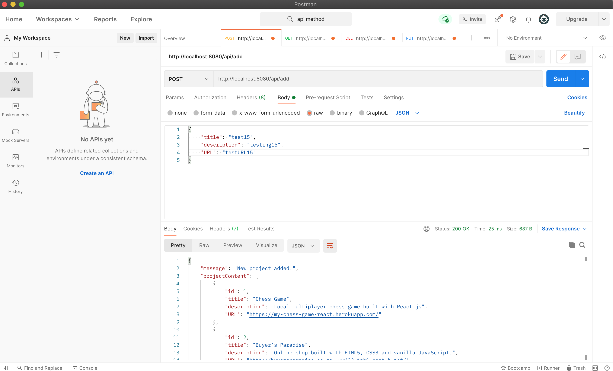
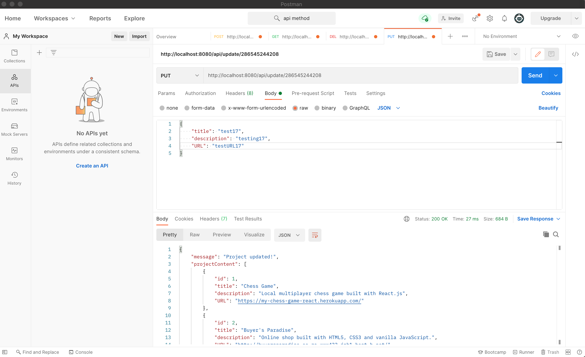
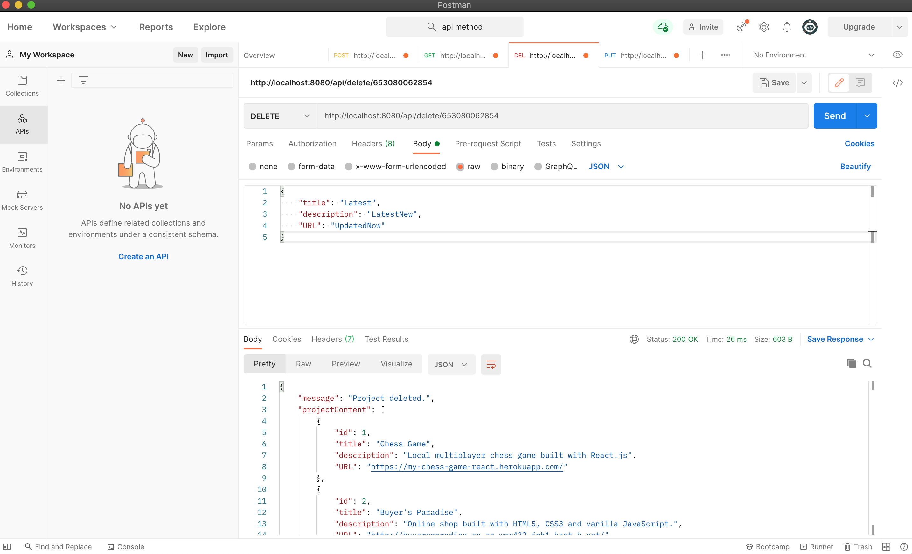

<a name="title"></a>

# Welcome to my CRUD application.

<a name="description"></a>

### Project Description:

This projects requires me to build an API using express that will be able to perform CRUD operations. I have tested this API using the Postman API testing software.

<a name="contents"></a>

# Table of contents

- [Project name](#title)
- [Project description](#description)
- [Table of contents](#contents)
- [Installation](#installation)
- [Usage](#usage)

  - [Screenshots](#screenshots)

# Installation

#### Step 1

```bash
Open your terminal
cd "your-projects-folder"
```

#### Step 2

```
Download the compressed project file from Dropbox.  Unzip the file once downloaded.
```

#### Step 3

```bash
npm install express morgan
npm i -D nodemon
```

#### Step 4

```
Open the package.json file and add the following line under the 'scripts' heading.

"dev": "nodemon myServer.js"

```

#### Step 5

```
Start the app by running:

npm run dev
```

#### Step 6

```
Download Postman if you do not have it installed already.

Below is a link to download the Postman software:

https://www.postman.com/downloads/
```

#### Step 7

```
Open a new tab in Postman and connect to http://localhost:8080/api

This will display the web projects stored in the webProjects.json file.
```

#### Step 8

```
In order to perform CRUD operations please see the guide below:

GET method:

Browse to http://localhost:8080/api

This will display the JSON data in Postman.


POST method:

Browse to http://localhost:8080/api/add
Then click on 'Body', select 'raw' from the dropdown and 'JSON' from the following dropdown.
Add a JSON object by specifying the title, description an URL.  The ID will be assigned automatically.

DELETE method:

Browse to http://localhost:8080/api/delete/ and then add the id of the element you would like to delete, example:

http://localhost:8080/api/delete/1335983146167

PUT method:

Browse to http://localhost:8080/api/update/ and then add the id of the element you would like to delete, example:

http://localhost:8080/api/update/1335983146167

Then click on 'Body', select 'raw' from the dropdown and 'JSON' from the following dropdown.
Add a JSON object by specifying the title, description an URL.  The ID will be saved and re-assigned automatically.
```

<a name="usage"></a>

#### Usage

`The screenshots below show how to perform the different CRUD operations on the API using postman.`

# Screenshots

#### GET request



#### POST request



#### PUT request



#### Delete request


